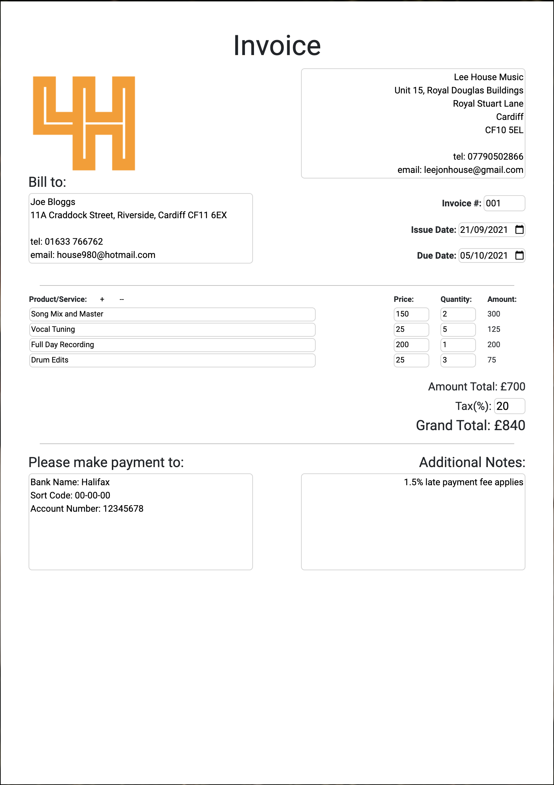
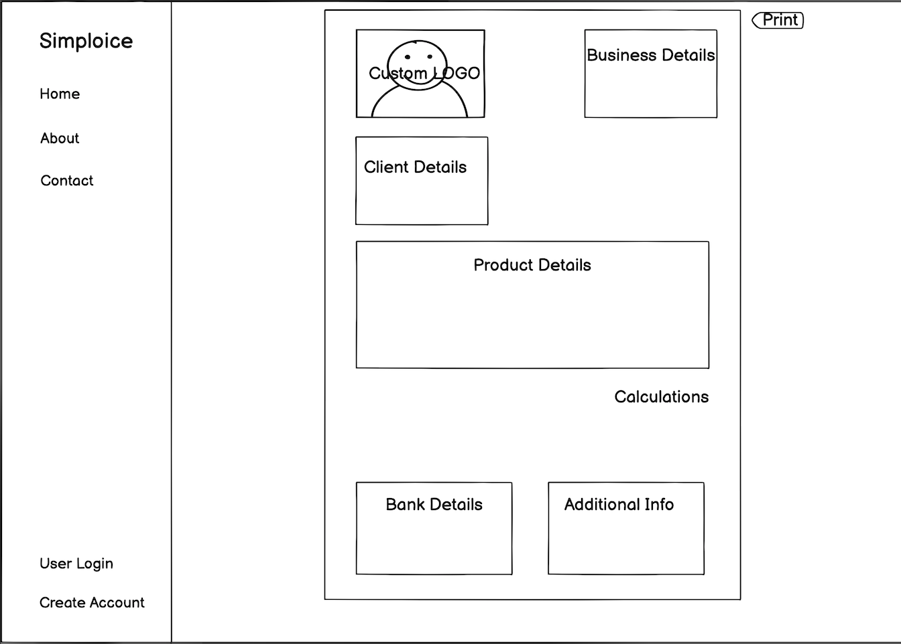

# Simploice - Simple Free Invoicing

Simploice was created as a simple way to create and save or print invoices for small businesses and sole traders without the need for expensive comprehensive subcription based software or services, and with a more intuitive editing approach than using a MS Word template.

## Wireframe:
- Wireframe was created using Balsamiq.
- [View full wireframe here](assets/images/simploice-wireframe.png)

## Features 

I wanted this website to just offer a simple invoice design with built-in calculations to assist with cost totalling and invoice saving and printing.

### Features Left to Implement

- Add an 'About' and 'Contact' page so users can understand the reason for the service and also get in touch to offer development suggestions.
- Create a customer login account with the ability to save and recall invoices.
- Use Bootstap to create a dynamic layout for mobile; since the idea of this site is to present an invoice design on an A4 sheet of paper, the dynamic layout would need to be completely changed from an A4 fixed layout to a long and narrow list of fields that can later be printed to the A4 page layout.
- Remove 15 row item limit and create multi-page invoice.
- Add ability to e-mail invoice straight to client from invoice page.

## Testing 

Chrome was used to create this website and it is only currently functioning as should on Chrome. Safari and Firefox have been tested but have slight layout indescrepencies with the textarea tag widths; cross-browser compatibility will be improved in the future. Chrome dev tools were used to test the site and chase and monitor the javascript code to fix bugs.

### Validator Testing 

- HTML - [W3C Validator](http://jigsaw.w3.org/css-validator/validator?uri=https%3A%2F%2Fwinterheartlee.github.io%2Fleehouseinvoicegen%2F&profile=css3svg&usermedium=all&warning=1&vextwarning=)
  - The site currently has no errors from the W3C Validator.
- CSS - [Jigsaw Validator](http://jigsaw.w3.org/css-validator/validator?uri=https%3A%2F%2Fwinterheartlee.github.io%2Fleehouseinvoicegen%2F&profile=css3svg&usermedium=all&warning=1&vextwarning=)
  - No errors were found when passing through the official W3C Jigsaw validator.
- Javascript - [Jshint](https://jshint.com/) 
  - No serious issues were detected when passed through the Jshint validator.

### Unfixed Bugs

- Once an image has been added to the logo area, the 'upload' button is removed so that it does not show on the printed invoice, however there is no way to then change the image without refreshing.
- The 'Amount' and 'Grand Total' calculations can sometimes display as long float numbers with very long decimal places; I tried to force the results to always display to a double float using <b>parseFloat().toFixed(2)</b>, however I was unable to successfully implement it to prevent long float numbers.
- The first item/product of the invoice list does not trigger the calculation for 'Amount' and 'Grand Total' until the second row received a KeyUp.

## Deployment

This site has been deployed using GitHub pages, the live link can be found here - https://winterheartlee.github.io/leehouseinvoicegen/

## Credits 

The programming languages used were HTML5, CSS3 and Javascript.

### Frameworks, Libraries and Programs:

1. [Bootstrap 5:](https://getbootstrap.com/docs/4.6/getting-started/introduction/)
    - Bootstrap was used mainly for its grid system to create the layout.
1. [Google Fonts:](https://fonts.google.com/)
    - Google fonts were used to import the 'Roboto' font for all the text on the invoice and the 'Lobster' font was used for the Simploice logo in the sidebar navigation.
1. [Font Awesome:](https://fontawesome.com/)
    - Simploice sidebar receipt icon was used.
1. [GitPod](https://www.gitpod.io/)
    - GitPod was the IDE used to create the code.
1. [GitHub:](https://github.com/)
    - GitHub is used to store the projects code after being pushed from GitPod.

### Media:

- Background images are random embedded photographs from [Upsplash](https://unsplash.com/photos/OQlPahHa7Bc) using the free link at https://source.unsplash.com

### Javascript Code:

- The javascript code needed to print the styled content of the invoice div proved to be beyond my ability to develop and therefore the full code was used from [JS Fiddle](https://jsfiddle.net/crabbly/gqjqh1gn/) and was created by user [Rodrigo Vieira](https://github.com/crabbly).
- The javascript code needed to upload and display as user image file was too difficult to implement by myself and therefore the code was amended from [JS Fiddle](https://jsfiddle.net/rustybailey/2b7dD/) and was created by user [Rusty Bailey](https://github.com/rustybailey).